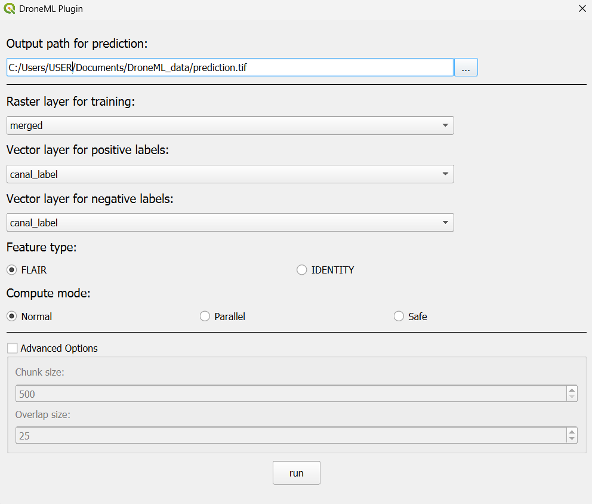

# DroneML

QGIS plugin for drone image classification using machine learning.

## Installation

### Step 1: Install dependencies

In QGIS, go to `Plugins` > `Python Console`.

Run the following Python code to install the dependencies required by the plugin:

```python
!pip install -U segmentmytif
```

### Step 2: Restart QGIS
Restart QGIS for the installation of the dependencies (step 1) to take effect.

### Step 3: Install DroneML plugin from ZIP

Download the ZIP file of DroneML from [this page](https://github.com/DroneML/DroneML/blob/release/DroneML.zip).

Then, go to `Plugins` > `Manage and Install Plugins...` > `Install from ZIP` and select the downloaded `droneml.zip` file   

## Getting Started

The interface of DroneML plugin is as below:



With the following input fields:

- Output Path for prediction: The output path for the prediction result.
- Raster layer for training: The input raster layer in your QGIS project that will be used for training the model.
- Vector layer for positive/negative labels: The input vector layer in your QGIS project for positive/negative labels. Should be ploygon or multi-polygons.
-Feature type: The feature type of the input vector layer. By default "FLAIR". "IDENTITY" means use the original raster layer as the feature.
- Compute mode: The mode of computation.
  - "Normal": read in all the data and perform the computation. Suitable for small datasets that fits in memory.
  - "Parallel": read in data in chunks and perform the computation with several chunks together. Suitable for medium-sized datasets, where we assume several chunks can fit in memory.
  - "Safe": read in data in chunks, perform the computation with one chunk at a time. Suitable for large datasets that do not fit in memory.
- Chunk size: The size of the chunk to be read in. Only used in "Parallel" and "Safe" mode.
- Overlap: The overlap between chunks when performing feature extraction. Only used in "Parallel" and "Safe" mode. Because of possible edge effects, a minimum overlap of 20 is recommended.

## Tips

- This plugin only support segment single raster layer in QGIS. To perform segmentation on multiple raster layers, please consider the following steps: 
  1. Use the [Build Virtual Raster](https://docs.qgis.org/3.34/en/docs/user_manual/processing_algs/gdal/rastermiscellaneous.html#build-virtual-raster) under the Processing plugin to merge the raster layers into one raster layer with multiple bands. 
  2. Then export the merged virtual raster layer as a GeoTIFF file.
  3. Reload the GeoTIFF file into QGIS
  4. Ise the DroneML plugin to perform segmentation on the reloaded multi-band raster layer.

- Although the plugin supports ovewritting existing tif files with prediction, but if a tif file has already been loaded in QGIS, the ovewritting will fail. Therefore, if you want to overite a tif file, please remove it from the QGIS project first.

- For large datasets, it is recommended to use the "Parallel" or "Safe" mode to avoid memory issues. You can configure the chunk size and overlap to optimize the performance. It is not recommended to set the chunk size too small, as it will increase the overhead.

## Trouble shooting: Manual Installation if install from ZIP fails

Clone the `droneml` folder, which is needed for the segmentation part of the plugin.

```bash
git clone git@github.com:DroneML/droneml.git
```

Copy the `droneml` folder to the QGIS plugins directory. Examples on different operating systems:

- Windows: `C:\Users\USER\AppData\Roaming\QGIS\QGIS3\profiles\default\python\plugins\minimal`
- Linux: `~/.local/share/QGIS/QGIS3/profiles/default/python/plugins/minimal`
- MacOS: `~/Library/Application Support/QGIS/QGIS3/profiles/default/python/plugins/minimal`

Then go to `Plugins` > `Manage and Install Plugins...`, check the box next to `DroneML`. The plugin should now be available in the QGIS interface.

## Acknowledgements
Icon image generated by [Flaticon](https://www.flaticon.com/).
